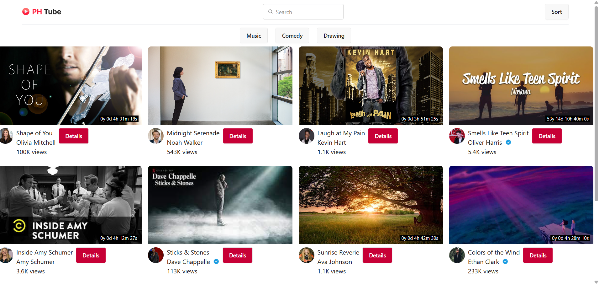
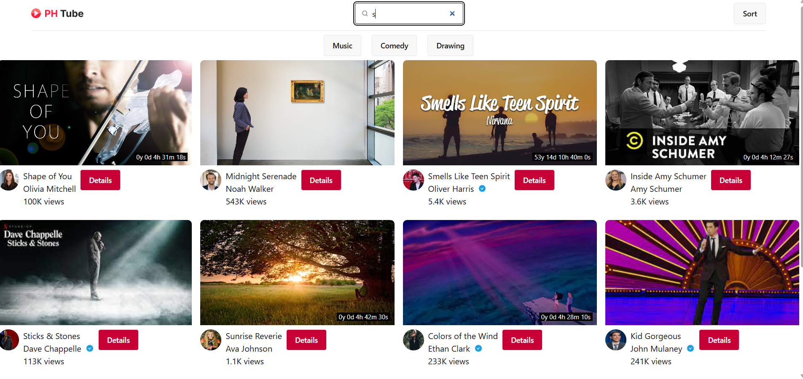
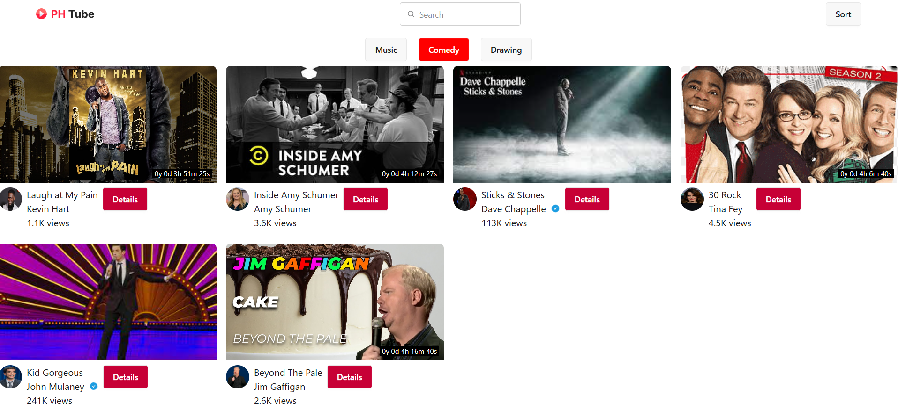

# 🎬 PH Tube

PH Tube is a responsive **video sharing web application** built using **JavaScript** and **Tailwind CSS**.  
The website loads videos dynamically from an API and allows users to browse, search, filter, and sort videos through a clean and user-friendly interface.

---

## 🚀 Features

- 📺 Dynamic video loading using API
- 🔍 Search functionality
- 🗂 Filter videos by category (Music, Comedy, Drawing)
- 🔄 Sort videos
- ⚡ Fast client-side rendering
- 🎨 Clean and responsive UI
- 📱 Mobile friendly layout

---

## 🛠 Technologies Used

- **HTML5**
- **JavaScript (ES6)**
- **Tailwind CSS**
- **REST API**

---

## 📸 Screenshots

### Home Page


### Search Feature


### Category Filter


---


## ⚙️ How to Run the Project

1. Clone the repository

```
git clone https://github.com/munnabiswas99/PH_Tube-API-Data-Manupulation-
```

2. Go to the project folder

```
cd ph-tube
```

3. Open **index.html** in your browser.

---

## 🌐 Live Demo

[https://munnabiswas99.github.io/PH_Tube-API-Data-Manupulation-/](https://munnabiswas99.github.io/PH_Tube-API-Data-Manupulation-/)

---

## 📌 Future Improvements

- Video player page
- User authentication
- Watch history

---

## 👨‍💻 Author

**Munna**

---

## ⭐ Support

If you like this project, please give it a **star ⭐ on GitHub**.